# 🏪 Bio Care Consumers - Desktop Sales Management System

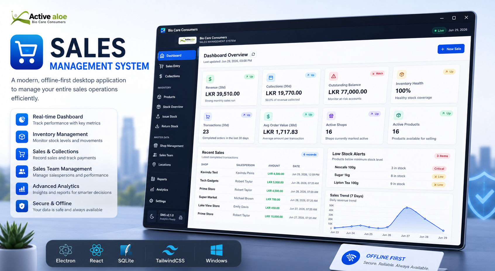

**A powerful, offline-first desktop application for managing field sales operations - built with Electron, React, and SQLite.**

[](https://github.com)
[](https://electronjs.org)
[](https://reactjs.org)
[](https://sqlite.org)
[](https://tailwindcss.com)
[](https://microsoft.com)


---

## 📋 Table of Contents

- [Overview](#-overview)
- [Architecture](#-architecture)
- [Features](#-features)
- [Tech Stack](#-tech-stack)
- [Database Schema](#-database-schema)
- [Project Structure](#-project-structure)
- [Getting Started](#-getting-started)
- [Scripts Reference](#-scripts-reference)
- [Keyboard Shortcuts](#-keyboard-shortcuts)
- [IPC Communication](#-ipc-communication)
- [Configuration](#-configuration)
- [Building & Distribution](#-building--distribution)
- [Seed Data](#-seed-data)

---

## 🌟 Overview

The **Sales Management System (SMS v2.1.0)** is a cross-platform desktop application targeting Windows, built to help businesses manage their entire field sales workflow — from stock issuance to salespersons, through sales recording at customer shops, to collections and advanced analytics.

It operates **fully offline** using a local SQLite database and is distributed as a native Windows installer (NSIS), making it ideal for businesses that operate without reliable internet connectivity.

### Key Highlights

- 🔒 **Passkey-based authentication** with session persistence
- 🌙 **Dark/Light mode** support (system preference + manual toggle)
- 📊 **Real-time KPI dashboard** with 8 key business metrics
- 📦 **End-to-end stock tracking** from warehouse → salesperson → sale
- 💰 **Credit/Cash payment support** with outstanding balance management
- 📈 **Advanced analytics** with interactive charts powered by Recharts
- 🖨️ **Report generation** with CSV export
- 🗄️ **Automatic database backup** with timestamped copies

---

## 🏗️ Architecture

The application follows a clean **three-process Electron architecture**:

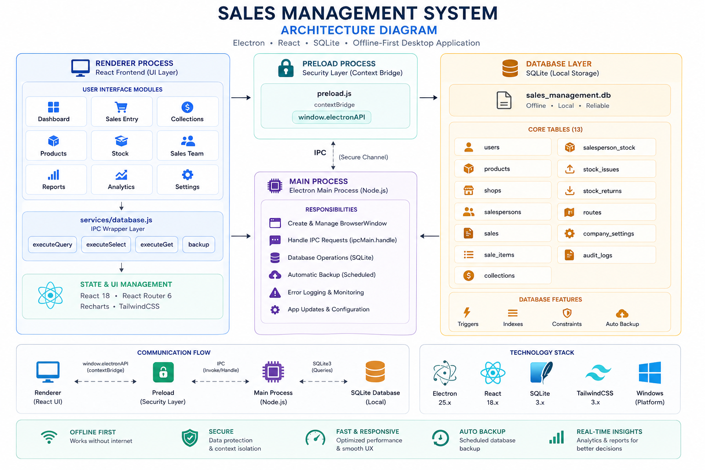
---
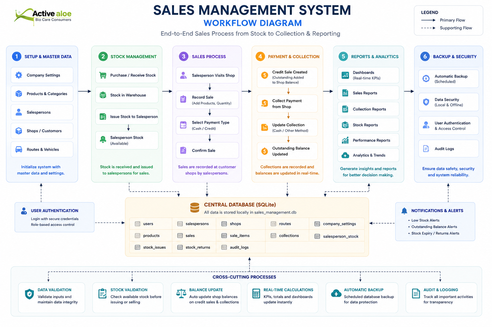
---
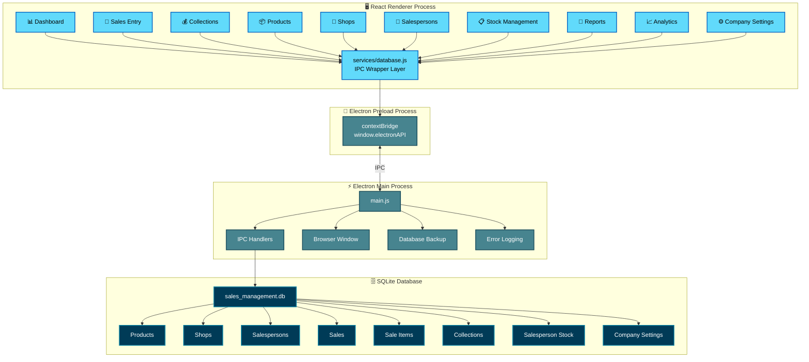
```mermaid
flowchart TB

    %% ==========================
    %% Renderer Layer
    %% ==========================
    subgraph UI["🖥️ React Renderer Process"]
        Dashboard["📊 Dashboard"]
        Sales["🛒 Sales Entry"]
        Collections["💰 Collections"]
        Products["📦 Products"]
        Shops["🏪 Shops"]
        Salespersons["👥 Salespersons"]
        Stock["📋 Stock Management"]
        Reports["📄 Reports"]
        Analytics["📈 Analytics"]
        Settings["⚙️ Company Settings"]

        Services["services/database.js<br/>IPC Wrapper Layer"]
    end

    Dashboard --> Services
    Sales --> Services
    Collections --> Services
    Products --> Services
    Shops --> Services
    Salespersons --> Services
    Stock --> Services
    Reports --> Services
    Analytics --> Services
    Settings --> Services

    %% ==========================
    %% Preload Layer
    %% ==========================
    subgraph PRELOAD["🔐 Electron Preload Process"]
        ContextBridge["contextBridge<br/>window.electronAPI"]
    end

    Services --> ContextBridge

    %% ==========================
    %% IPC Communication
    %% ==========================
    ContextBridge <-->|IPC| MainProcess

    %% ==========================
    %% Main Process
    %% ==========================
    subgraph MAIN["⚡ Electron Main Process"]
        MainProcess["main.js"]

        IPC["IPC Handlers"]

        Window["Browser Window"]

        Backup["Database Backup"]

        Logger["Error Logging"]
    end

    MainProcess --> IPC
    MainProcess --> Window
    MainProcess --> Backup
    MainProcess --> Logger

    %% ==========================
    %% Database
    %% ==========================
    subgraph DB["🗄️ SQLite Database"]
        SQLite["sales_management.db"]

        ProductsTable["Products"]
        ShopsTable["Shops"]
        SalespersonsTable["Salespersons"]
        SalesTable["Sales"]
        SaleItems["Sale Items"]
        CollectionsTable["Collections"]
        StockTable["Salesperson Stock"]
        SettingsTable["Company Settings"]
    end

    IPC --> SQLite

    SQLite --> ProductsTable
    SQLite --> ShopsTable
    SQLite --> SalespersonsTable
    SQLite --> SalesTable
    SQLite --> SaleItems
    SQLite --> CollectionsTable
    SQLite --> StockTable
    SQLite --> SettingsTable

    %% ==========================
    %% Styling
    %% ==========================
    classDef frontend fill:#61DAFB,color:#000,stroke:#0A66C2,stroke-width:2px;
    classDef backend fill:#47848F,color:#fff,stroke:#1B4D5C,stroke-width:2px;
    classDef database fill:#003B57,color:#fff,stroke:#0B84A5,stroke-width:2px;

    class Dashboard,Sales,Collections,Products,Shops,Salespersons,Stock,Reports,Analytics,Settings,Services frontend;
    class ContextBridge,MainProcess,IPC,Window,Backup,Logger backend;
    class SQLite,ProductsTable,ShopsTable,SalespersonsTable,SalesTable,SaleItems,CollectionsTable,StockTable,SettingsTable database;
```

### Communication Flow

| Layer | Technology | Responsibility |
|-------|-----------|----------------|
| **Renderer** | React 18, React Router 6, Recharts, TailwindCSS | UI rendering, state management, routing |
| **Context Bridge** | `preload.js` — Electron `contextBridge` | Secure IPC exposure via `window.electronAPI` |
| **Main Process** | `main.js` — Node.js + Electron | Window management, SQLite operations, backups |
| **Database** | SQLite3 (`sqlite3` npm package) | Persistent local data storage |

---

## ✨ Features

### 📊 Dashboard
- **8 KPI Cards**: Total Revenue, Collections, Outstanding Balance, Inventory Health, Transactions, Average Order Value, Active Shops, Active Products
- **Recent Sales Table**: Last 10 sales with shop, salesperson, amount, and payment type
- **Low Stock Alerts**: Products below `min_stock_level` with quantity indicators
- **Auto-refresh**: Data reloads every time the dashboard is visited
- **DB Ping Status**: Live database connectivity indicator in the footer (pings every 15s)

### 🛒 Sales Entry
- Multi-item sales recording with per-line totals
- Salesperson and Shop selection with stock validation
- Cash / Credit payment type selection
- Automatic shop `current_balance` updates on credit sales
- Stock deducted from salesperson inventory on each sale

### 💰 Collections Entry
- Record payment collections from shops by salesperson
- Updates shop's `current_balance` in real time
- History table with date, amount, and payment method

### 📦 Product Management
- Full CRUD for product catalog
- Fields: Code, Name, Unit Price, Cost Price, Stock Qty, Min/Max Stock Levels, Unit, Category, Brand, Supplier
- Active/Inactive status toggle
- Category-based filtering

### 📊 Stock Dashboard
- Per-product and per-salesperson stock overview
- Visual low-stock indicators
- Total inventory value calculation

### 🚛 Stock Issue
- Issue stock from main warehouse → individual salespersons
- Decrements `products.stock_quantity`
- Increments `salesperson_stock.quantity`
- Vehicle number and notes support

### 🔄 Stock Return
- Record salesperson stock returns to the warehouse
- Condition tracking: good / damaged, with inspection flag
- Reverses stock quantities accordingly

### 🏪 Shop Management
- Full CRUD for customer shops
- Fields: Code, Name, Owner, Contact, Address, District, Town, Route
- Credit Limit, Current Balance, Payment Terms, Preferred Payment Method
- Active/Inactive toggle

### 👥 Sales Team Management
- Full CRUD for salespersons
- Fields: Code, Name, Contact, Email, Vehicle Number, Target Amount, Commission Rate, Start Date
- Per-salesperson target vs. actual sales performance
- Commission tracking

### 📍 Location Management
- Three-level geographic hierarchy: **District → Town → Route**
- Full CRUD for each level
- Routes linked to Towns, Towns linked to Districts
- Used for shop assignment and sales route planning

### 📈 Advanced Analytics
- Sales trend line charts by customizable date range
- Top products by revenue (bar chart)
- Payment method distribution (pie chart)
- Salesperson performance comparison
- Powered by [Recharts](https://recharts.org)

### 📄 Reports Generator
- Generate detailed reports: Sales, Collections, Stock Issues, Stock Returns
- Date range and entity filtering
- **CSV export** for all report types via `exportToCSV()` utility

### ⚙️ Company Settings
- Customizable company name, tagline, and logo (base64)
- Passkey change capability
- Changes reflect in the System Navbar and footer branding
- Synced to SQLite `company_settings` table + `localStorage` fallback

### 🔐 Authentication
- Single-user passkey authentication (default: `admin123`)
- Session stored in `sessionStorage` (auto-clears on window close)
- Username persisted in `localStorage`

---

## 🛠️ Tech Stack

| Category | Technology | Version |
|----------|-----------|---------|
| **Desktop Runtime** | [Electron](https://electronjs.org) | ^25.0.0 |
| **UI Framework** | [React](https://reactjs.org) | ^18.2.0 |
| **Routing** | [React Router DOM](https://reactrouter.com) | ^6.8.0 |
| **Charting** | [Recharts](https://recharts.org) | ^2.4.3 |
| **Icons** | [Lucide React](https://lucide.dev) | ^0.263.1 |
| **Styling** | [TailwindCSS](https://tailwindcss.com) | ^3.4.18 |
| **Database** | [SQLite3](https://github.com/TryGhost/node-sqlite3) | ^5.1.6 |
| **Date Utilities** | [date-fns](https://date-fns.org) | ^2.29.3 |
| **Class Utilities** | [classnames](https://github.com/JedWatson/classnames) | ^2.3.2 |
| **Build Tool** | [react-scripts (CRA)](https://create-react-app.dev) | 5.0.1 |
| **Packager** | [electron-builder](https://electron.build) | ^26.0.12 |
| **Dev Orchestration** | [concurrently](https://github.com/open-cli-tools/concurrently) | ^7.6.0 |

---

## 🖥️ User Interface Screenshots

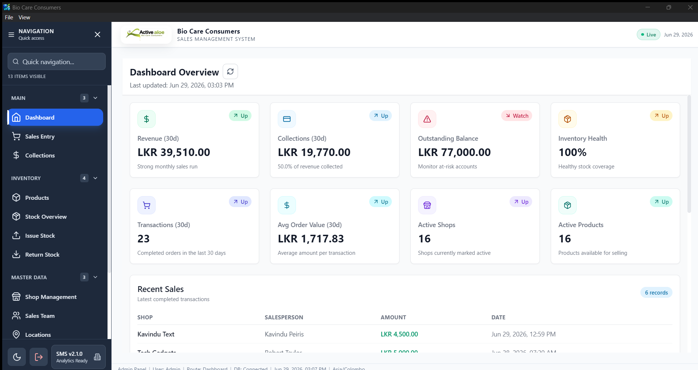
---
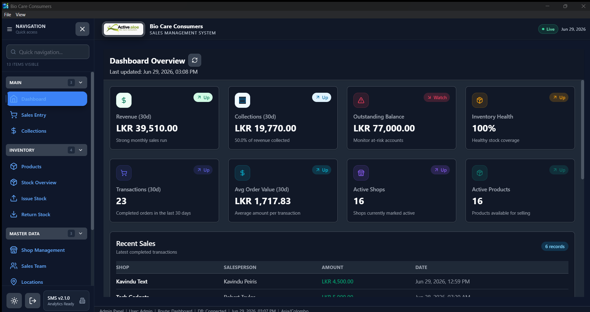
---
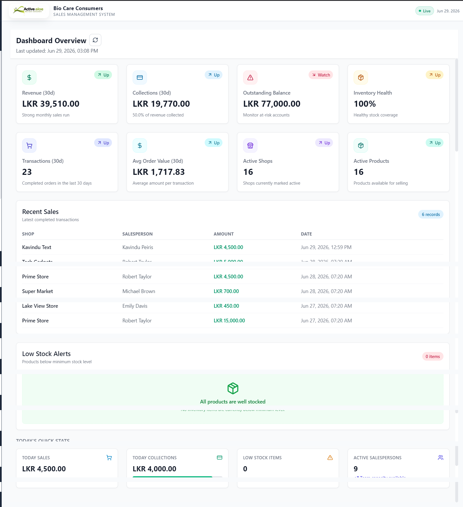
---
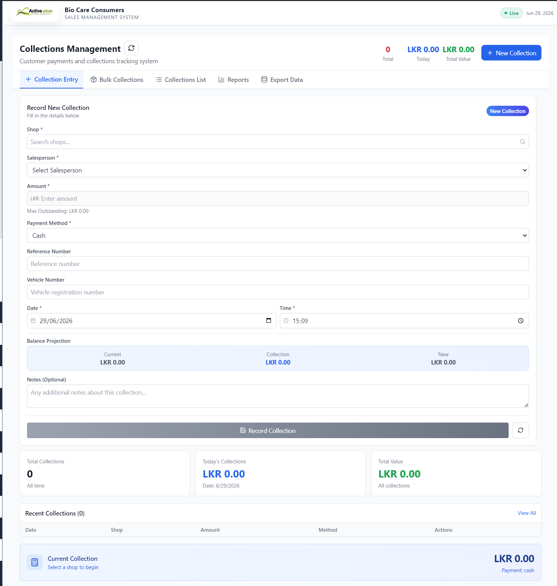
---
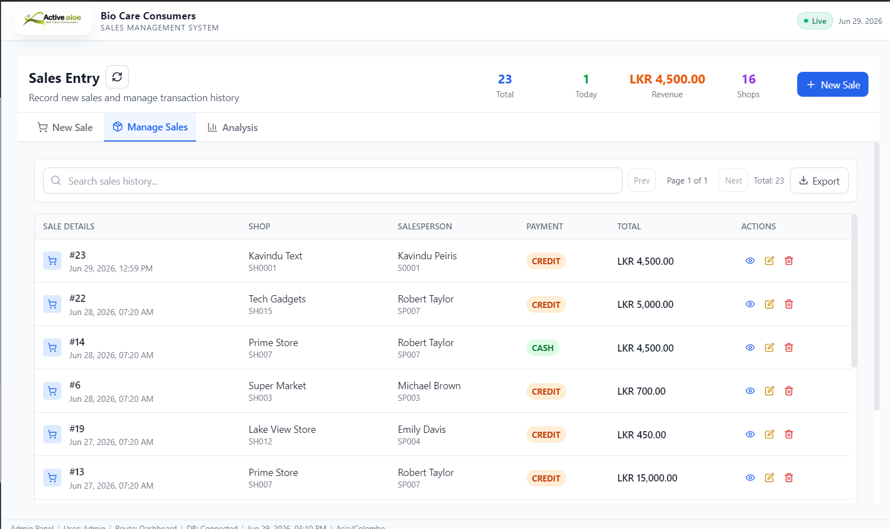
---
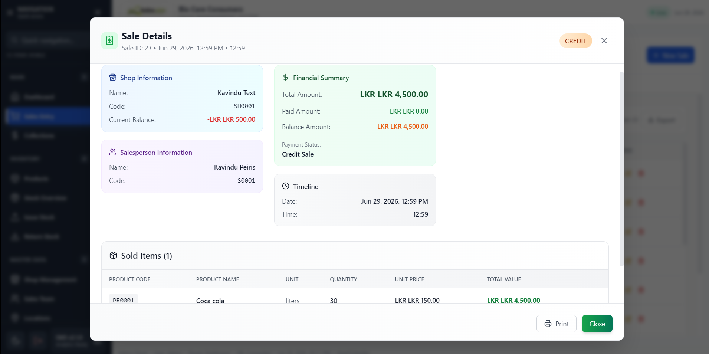
---
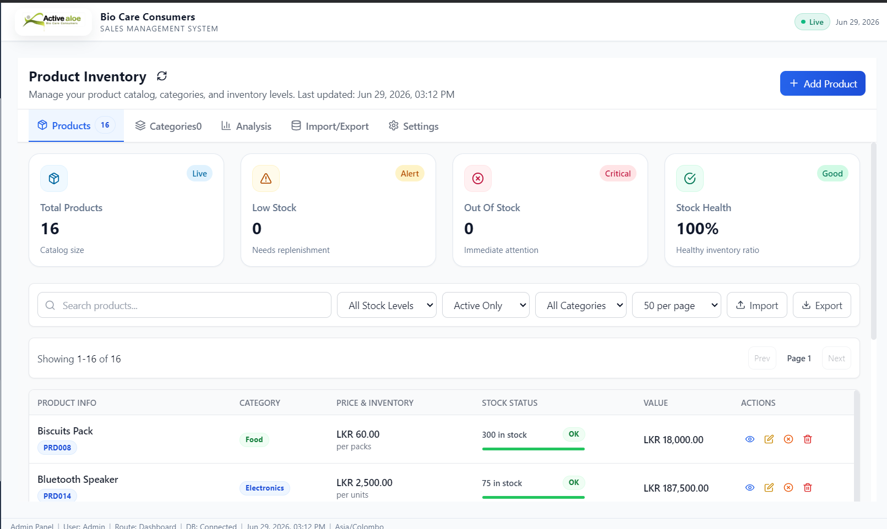
---
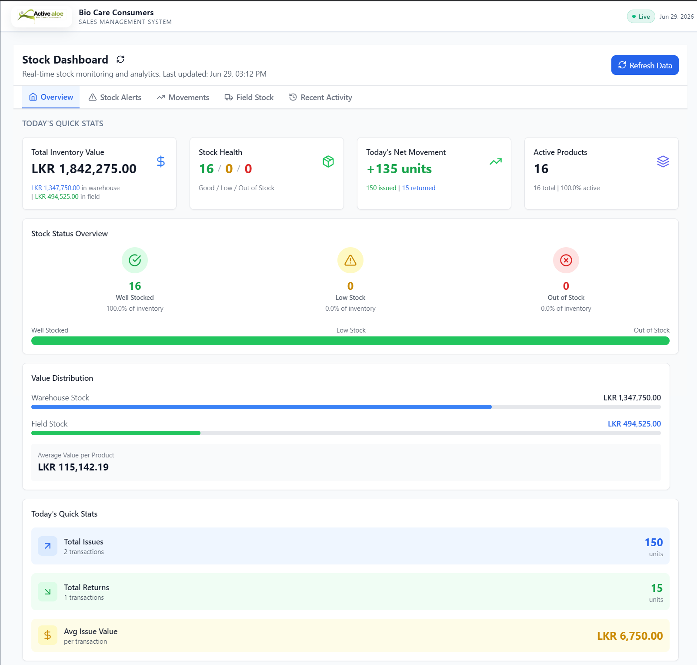
---
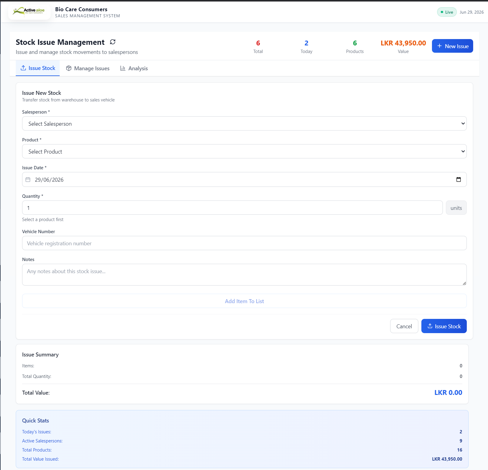
---
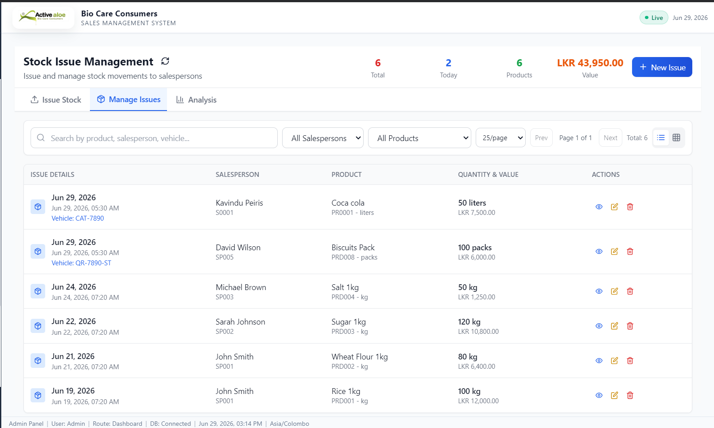
---
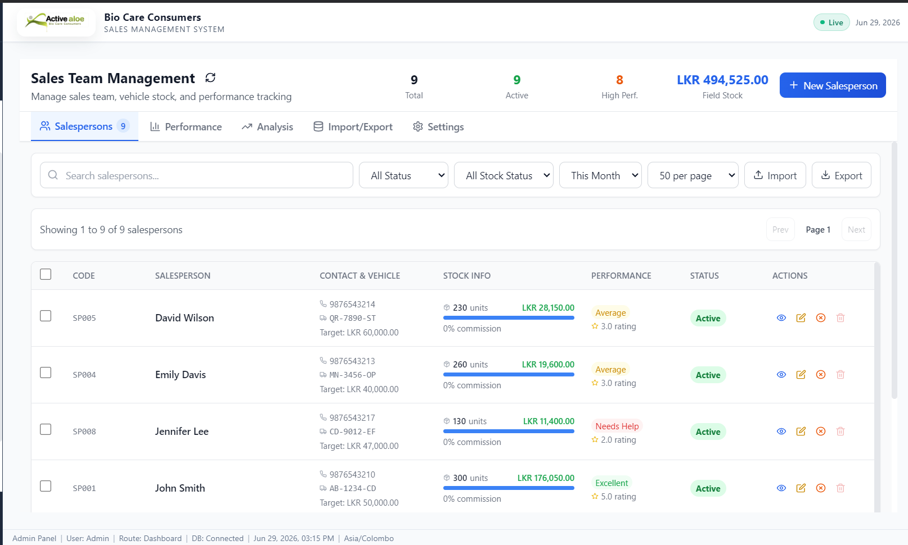
---
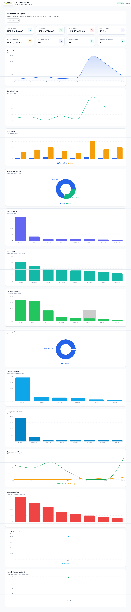
---
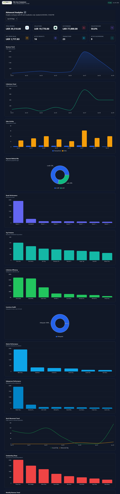
---
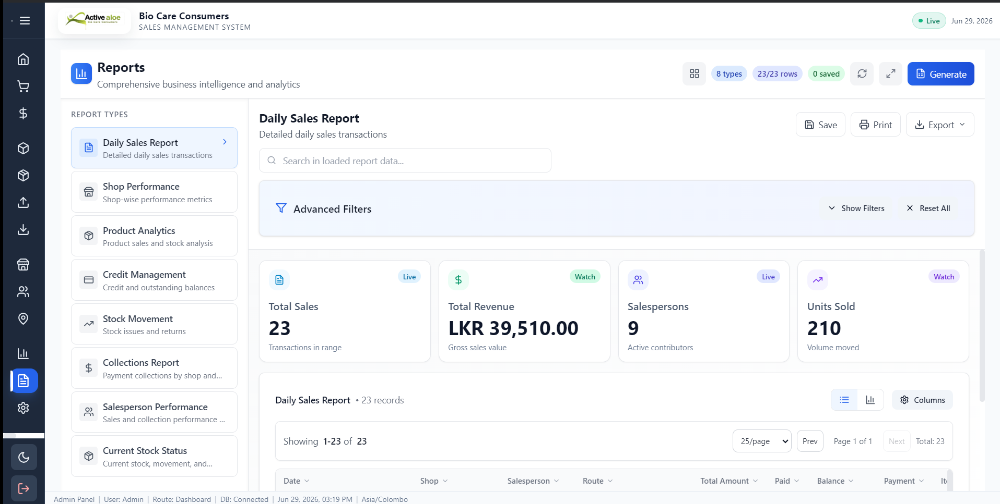
---
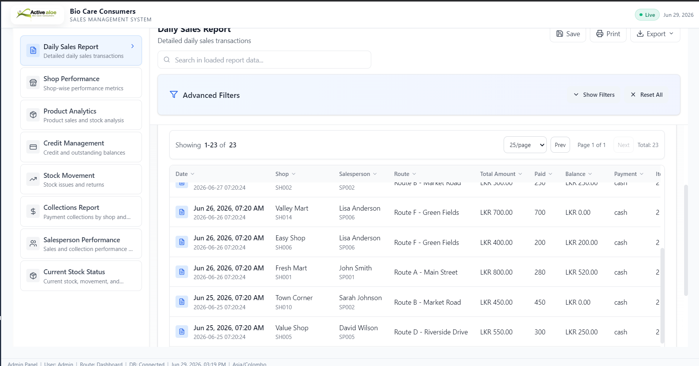
---

## 🗄️ Database Schema

The SQLite database is stored at:
```
%APPDATA%\sales-management-system\sales_management.db
```

### Entity Relationship Overview

```
districts (1) ──< towns (1) ──< routes (1) ──< shops
                                                 │
salespersons ────────────────────────────────── sales ──< sale_items ──< products
     │                                           │
     ├──< salesperson_stock >── products         └──> collections
     ├──< stock_issues >── products
     └──< stock_returns >── products

company_settings (single row)
```

### Tables

| Table | Description | Key Columns |
|-------|-------------|-------------|
| `districts` | Geographic districts | `code`, `name` |
| `towns` | Towns within districts | `code`, `name`, `district_id` |
| `routes` | Sales routes within towns | `code`, `name`, `town_id`, `description` |
| `products` | Product catalog | `code`, `name`, `unit_price`, `cost_price`, `stock_quantity`, `min_stock_level`, `max_stock_level`, `unit`, `category`, `brand`, `supplier` |
| `salespersons` | Sales team members | `code`, `name`, `vehicle_number`, `target_amount`, `commission_rate`, `start_date` |
| `shops` | Customer shops | `code`, `name`, `credit_limit`, `current_balance`, `payment_terms`, `district_id`, `town_id`, `route_id` |
| `sales` | Sales transactions | `shop_id`, `salesperson_id`, `route_id`, `total_amount`, `paid_amount`, `balance_amount`, `payment_type`, `payment_method`, `discount_amount`, `tax_amount` |
| `sale_items` | Line items per sale | `sale_id`, `product_id`, `quantity`, `unit_price`, `total_price` |
| `collections` | Payment collections | `shop_id`, `salesperson_id`, `amount`, `payment_method`, `reference_number` |
| `salesperson_stock` | Per-salesperson inventory | `salesperson_id`, `product_id`, `quantity` (UNIQUE per pair) |
| `stock_issues` | Stock issued to salespersons | `salesperson_id`, `product_id`, `quantity_issued`, `vehicle_number` |
| `stock_returns` | Stock returned from salespersons | `salesperson_id`, `product_id`, `quantity_returned`, `reason`, `condition`, `inspection_required` |
| `company_settings` | Single-row branding config | `company_name`, `company_tagline`, `company_logo` |

### Database Triggers

| Trigger | On Table | Purpose |
|---------|----------|---------|
| `check_product_stock_positive` | `products` | Prevents stock going negative |
| `check_salesperson_stock_positive` | `salesperson_stock` | Prevents salesperson stock going negative |
| `update_shops_timestamp` | `shops` | Auto-updates `updated_at` |
| `update_salespersons_timestamp` | `salespersons` | Auto-updates `updated_at` |
| `update_company_settings_timestamp` | `company_settings` | Auto-updates `updated_at` |

### Performance Indexes (17 total)

```sql
-- Shops
idx_shops_district, idx_shops_town, idx_shops_route, idx_shops_active

-- Sales
idx_sales_date, idx_sales_shop, idx_sales_salesperson

-- Collections
idx_collections_date, idx_collections_shop, idx_collections_salesperson

-- Sale Items
idx_sale_items_sale, idx_sale_items_product

-- Stock
idx_stock_issues_date, idx_stock_issues_salesperson, idx_stock_issues_product
idx_stock_returns_date, idx_stock_returns_salesperson, idx_stock_returns_product

-- Salesperson Stock
idx_salesperson_stock_lookup (composite: salesperson_id, product_id)
```

---

## 📁 Project Structure

```
sales-management-system/
├── 📄 main.js                    # Electron main process — DB init, IPC, window
├── 📄 preload.js                 # Context bridge — exposes electronAPI to renderer
├── 📄 package.json               # Dependencies, scripts, electron-builder config
├── 📄 electron-builder.yml       # Cross-platform packaging configuration
├── 📄 tailwind.config.js         # TailwindCSS configuration
├── 📄 seed-data.js               # Standalone DB seed script (for dev)
│
├── 📁 assets/
│   ├── icon.ico                  # Windows application icon
│   └── icon.png                  # Application icon (PNG)
│
├── 📁 public/
│   ├── index.html                # HTML entry point
│   └── logo.png                  # Application logo
│
├── 📁 build/                     # React production build output (git-ignored)
├── 📁 dist/                      # Electron build output / installer (git-ignored)
│
└── 📁 src/
    ├── 📄 index.js               # React DOM entry point
    ├── 📄 App.js                 # Root component — routing, auth, dark mode, branding
    ├── 📄 App.css                # App layout styles
    ├── 📄 index.css              # Global CSS reset
    │
    ├── 📁 components/
    │   ├── 📄 Sidebar.js                # Collapsible nav sidebar w/ search & sections
    │   ├── 📄 Dashboard.js              # KPI cards, recent sales, low-stock alerts
    │   ├── 📄 SalesEntry.js             # Multi-item sales recording form
    │   ├── 📄 CollectionsEntry.js       # Payment collection recording
    │   ├── 📄 ProductManagement.js      # Product CRUD with category filter
    │   ├── 📄 StockDashboard.js         # Stock overview by product/salesperson
    │   ├── 📄 StockIssue.js             # Issue stock to salesperson
    │   ├── 📄 StockReturn.js            # Return stock from salesperson
    │   ├── 📄 ShopManagement.js         # Shop CRUD + balance tracking
    │   ├── 📄 SalespersonManagement.js  # Salesperson CRUD + performance
    │   ├── 📄 LocationManagement.js     # District / Town / Route CRUD
    │   ├── 📄 AdvancedAnalytics.js      # Charts: trend, top products, payment dist.
    │   ├── 📄 ReportsGenerator.js       # Report generation + CSV export
    │   ├── 📄 CompanySettings.js        # Branding, passkey, user settings
    │   ├── 📄 LoginPage.js              # Passkey auth screen
    │   └── 📁 common/
    │       ├── 📄 Badge.js              # Status/category badge chip
    │       ├── 📄 Modal.js              # Reusable modal dialog
    │       ├── 📄 PageHeader.js         # Page title with breadcrumb
    │       ├── 📄 SystemNavbar.js       # Top bar with company branding
    │       └── 📄 Toast.js             # Toast notification component
    │
    ├── 📁 context/
    │   └── 📄 NotificationContext.js    # Global toast system (success/error/warning/info)
    │
    ├── 📁 services/
    │   └── 📄 database.js               # IPC wrappers + per-entity service objects
    │
    ├── 📁 utils/
    │   ├── 📄 helpers.js                # formatCurrency, formatDate, exportToCSV, safeMath
    │   └── 📄 validators.js             # Email, phone, form field validators
    │
    └── 📁 styles/
        ├── 📄 main.css                  # Primary stylesheet (light + dark variables)
        ├── 📄 App.css                   # App-level layout/sidebar styles
        └── 📄 dark-mode-auto.css        # System dark-mode detection styles
```

---

## 🚀 Getting Started

### Prerequisites

| Requirement | Version | Notes |
|------------|---------|-------|
| **Node.js** | v18+ | [Download](https://nodejs.org) |
| **npm** | v8+ | Bundled with Node.js |
| **OS** | Windows 10/11 | Primary target |

### Installation

```bash
# 1. Clone the repository
git clone https://github.com/your-org/sales-management-system.git
cd sales-management-system

# 2. Install all dependencies
npm install

# 3. (Optional) Pre-seed the database with sample data
npm run seed-db
```

### Running in Development

```bash
npm run dev
```

This concurrently:
1. Starts `react-scripts start` on `http://localhost:3000`
2. Waits for React dev server to be ready (`wait-on`)
3. Launches Electron pointing to `localhost:3000`

### Production Launch (Pre-built)

```bash
npm run build       # Build React app into ./build
npm run electron    # Launch Electron loading ./build
```

---

## 📜 Scripts Reference

| Script | Command | Description |
|--------|---------|-------------|
| `npm start` | `react-scripts start` | React dev server (browser mode — no DB) |
| `npm run build` | `react-scripts build` | Build React for production |
| `npm run electron` | `electron .` | Launch Electron app |
| `npm run electron-dev` | `concurrently ...` | React + Electron in dev mode |
| **`npm run dev`** | Alias for `electron-dev` | **Primary development command** ✅ |
| `npm run dist` | `build && electron-builder` | Build production Windows installer |
| `npm run seed-db` | `node seed-data.js` | Seed SQLite with sample data |
| `npm run clear-db` | `node -e "..."` | Delete the SQLite database file |
| `npm test` | `react-scripts test` | Run React unit tests |

---

## ⌨️ Keyboard Shortcuts

| Shortcut | Action |
|----------|--------|
| `Ctrl + B` | Toggle sidebar collapsed / expanded |
| `Ctrl + D` | Toggle Dark Mode / Light Mode |

---

## 🔌 IPC Communication

### API exposed via `window.electronAPI`

```javascript
window.electronAPI = {
  // Window controls
  minimizeWindow(),
  maximizeWindow(),
  closeWindow(),
  isMaximized(),                     // returns Promise<boolean>

  // Database operations
  db: {
    query(sql, params),              // INSERT/UPDATE/DELETE → { id, changes }
    select(sql, params),             // SELECT * → rows[]
    get(sql, params),                // SELECT one → row | null
    backup(),                        // Creates timestamped backup → backupPath
  },

  // Events
  on(channel, callback),
  removeAllListeners(channel),
  onBackupDatabase(callback),        // Returns cleanup function

  // Logging
  logError(error)
}
```

### IPC Channel Map

| Channel | Type | Handler | Operation |
|---------|------|---------|-----------|
| `db-query` | `handle` | `db.run()` | Write (INSERT/UPDATE/DELETE) |
| `db-select` | `handle` | `db.all()` | Read multiple rows |
| `db-get` | `handle` | `db.get()` | Read single row |
| `db-backup` | `handle` | `fs.copyFile()` | Database backup |
| `window-minimize` | `on` | `mainWindow.minimize()` | Minimize window |
| `window-maximize` | `on` | `mainWindow.maximize()` | Toggle maximize |
| `window-close` | `on` | `app.quit()` | Close app |
| `window-is-maximized` | `handle` | `mainWindow.isMaximized()` | Check maximize state |
| `log-error` | `on` | `fs.appendFile()` | Write error to log |

---

## ⚙️ Configuration

### Authentication

| Setting | Storage | Default |
|---------|---------|---------|
| Passkey | `localStorage.appPasskey` | `admin123` |
| Username | `localStorage.appUserName` | `Admin` |
| Session | `sessionStorage.isAuthenticated` | Auto-cleared on close |

### Company Branding

| Setting | Primary | Fallback |
|---------|---------|---------|
| Company Name | SQLite `company_settings` | `localStorage.appBranding` |
| Company Tagline | SQLite `company_settings` | `localStorage.appBranding` |
| Company Logo | SQLite `company_settings` (base64) | `localStorage.appBranding` |

### Theme

| Setting | Storage Key | Values |
|---------|------------|--------|
| Theme preference | `localStorage.theme` | `"dark"` / `"light"` |
| Fallback | System `prefers-color-scheme` | `dark` / `light` |
| Applied as | CSS class on `<body>` | `dark-mode` |
| Tailwind | CSS class on `<html>` | `dark` |

---

## 📦 Building & Distribution

### Build for Windows

```bash
npm run dist
# Output: dist/Sales Management System Setup x.x.x.exe
```

### Build Configuration Summary

| Setting | Value |
|---------|-------|
| App ID | `com.salesmanagement.app` |
| Product Name | `Sales Management System` |
| Output Dir | `dist/` |
| Windows Target | NSIS installer |
| One-click install | `false` (user selects directory) |
| Desktop shortcut | `true` |
| Start Menu shortcut | `true` |
| SQLite native module | Unpacked from ASAR |
| macOS target | DMG |
| Linux target | AppImage |

---

## 🌱 Seed Data

On first launch, the database is automatically seeded (only if `districts` table is empty):

| Entity | Count | Description |
|--------|-------|-------------|
| Districts | 5 | Central, North, South, East, West |
| Towns | 8 | Downtown, Midtown, Riverside, Harbor View, etc. |
| Routes | 8 | Route A through Route H |
| Products | 15 | Food (10), Cleaning (4), Electronics (1) |
| Salespersons | 8 | Full team with vehicle numbers and targets |
| Shops | 15 | Covering all districts/towns/routes |
| Sales | 22 | Cash/credit mix, spread over last 7 days |
| Collections | 9 | Sample collections from various shops |
| Stock Issues | 4 | Historical stock issued to salespersons |
| Stock Returns | 2 | Sample stock return records |

**Manual seed reset:**
```bash
npm run clear-db   # Delete database
npm run seed-db    # Re-seed (or just launch app to auto-seed)
```


---

<div align="center">

**Sales Management System v2.1.0** · Built with ❤️ using Electron + React + SQLite

</div>
